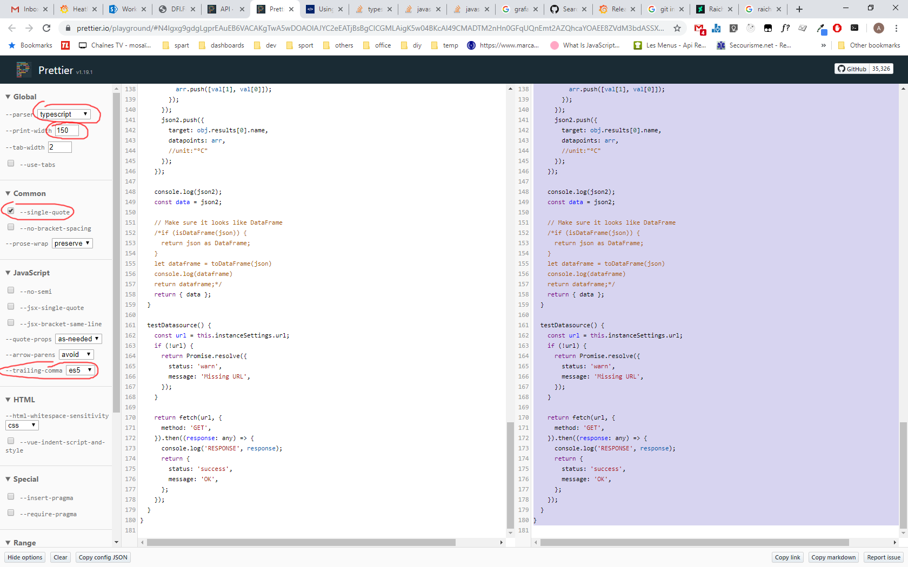
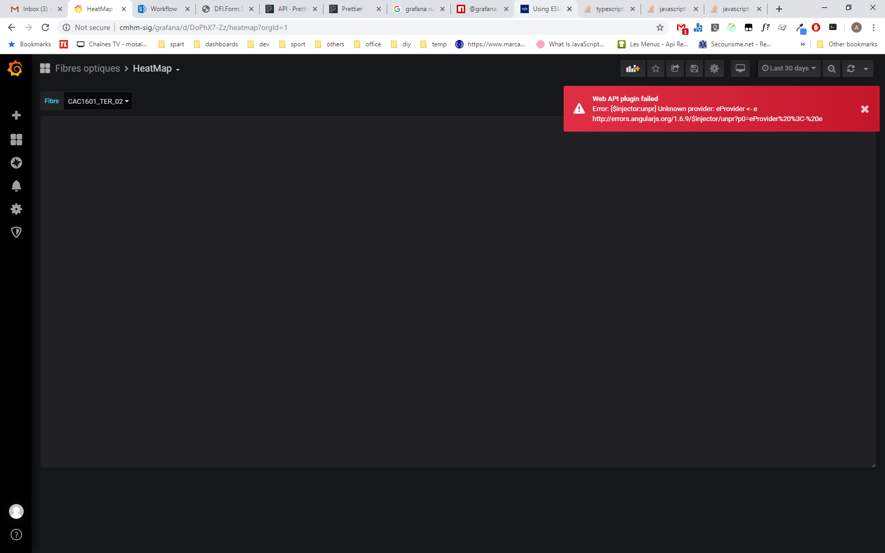

To develop and run the plugin : 

When you build the plugin (`npm run build`), Prettier can failed. First try to run `npm run dev` which should fix prettier issues.
Otherwise, copy paste code on [Prettier playground](https://prettier.io/playground/) with the following parameters :

After building the plugin, the following error can popup :

Grafana must be upgraded. See [Github issue](https://github.com/grafana/grafana/issues/21770)

-----
Grafana 6.5.3
Problem : Text editors in existing plugins (mainly datasources : sql editor for Postgres) doesn't show up. Conflict with ace in my plugin?
Solution: Must use react-ace@6.2.2 because ace version is the same one used by Grafan (in Angular component?)